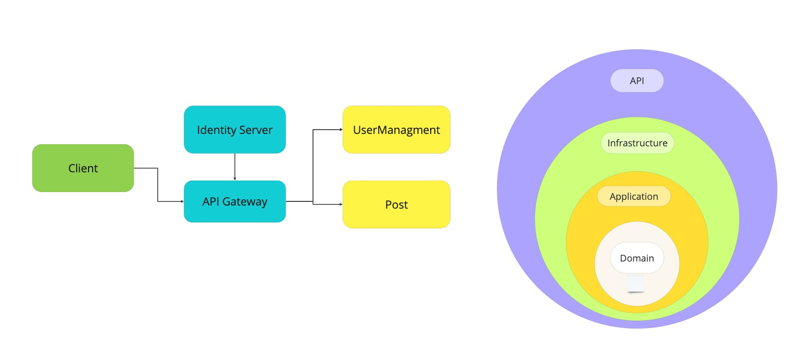

## Welcome To EmpowerID
Welcome to EmpowerID, an experimental application that integrates several cutting-edge technologies and architectural patterns. Your interest in this project is appreciated! If you find value in it, please consider giving it a ⭐ to show your support, which in turn motivates continuous improvement.

<a href="images/Architecture.jpg" target="_blank">

</a>
 <br/>

```
src
├── Gateway
│  ├── EmpowerID.Core
│  └── EmpowerID.Core.Infrastructure
│
├── Gateway
│   └── EmpowerID.ApiGateway
│
├── Identity
│   └── EmpowerID.IdentityServer
│
├── Services
│   ├── EmpowerID.Posts
│   └── EmpowerID.UserManagement
│
└── docker-compose
```
- **Core** <br/>
Defines abstract building blocks utilized across all projects.
 
- **Core.Infrastructure** <br/>
Contains abstractions and infrastructure implementations for use by microservices and their dependencies.
 
- **Identity § Gateway** <br/>
Encompasses project implementations that intersect multiple microservices, such as  `IdentityServer` and  `API Gateway `.
 
- **Services** <br/>
Backend microservices are structured in a vertically sliced manner with `API`, `Application`, `Domain`, and `Infrastructure` layers.
    ```
      ├── EmpowerID.Posts
      │   ├── API
      │   ├── Application
      │   ├── Domain
      │   └── Infrastructure
    ```
 
  - **API** <br/>
  Provides a RESTful interface for communication between client and server.
 
  - **Application** <br/> 
  Orchestrates interactions between the external world and the domain, executing application tasks through use cases by managing commands and queries.
 
  - **Domain** <br/>
  Implements domain logic through aggregates, commands, value objects, domain services, repository definitions, and domain events.
 
  - **Infrastructure** <br/>
  A supporting library for upper layers, handling infrastructural concerns such as data persistence via repository implementations, database mapping, and external integrations.
 
<br/>
 
## Technologies used
<ul>
<li>
<a href='https://get.asp.net' target="_blank">ASP.NET Core API</a> and <a href='https://learn.microsoft.com/en-us/dotnet/csharp/whats-new/csharp-12' target="_blank">C# 12</a>
    for cross-platform backend with:
<ul>
<li>.NET 8</li>
<li>Ocelot 22.0.1</li>
<li>Marten 6.4.1</li>
<li>MSSQL 2019</li>
<li>Entity Framework Core 8.0.0</li>
<li>Postgres for Entity Framework Core 8.0.0</li>
<li>ASP.NET Core Identity 8.0.0</li>
<li>ASP.NET Core Authentication JwtBearer 8.0.0</li>
<li>Duende IdentityServer 6.3.8</li>
<li>MediatR 12.2.0</li>
<li>Polly 8.2.1</li>
<li>Fluent Assertions 6.12.0</li>
<li>XUnit 2.6.5</li>
<li>NSubstitute 5.1.0</li>
<li>Swagger 6.5.0</li>
<li>Confluent Kafka 2.3.0</li>
</ul>
 
<br/>
 
## Running Instructions
 
Running Microservices with Docker
The project is designed to be easily run within Docker containers. Simply follow these steps:

<ol>
 <li>Ensure you have Docker installed on your system.</li>
 <li>Using a terminal, execute the following command:</li>
</ol>
 
- Download Docker: <a href="https://docs.docker.com/docker-for-windows/wsl/" target="_blank">Docker Desktop with support for WLS 2</a>
<br/>
 
Using a terminal, run:
 
```console
$ docker-compose up
```
 Alternatively, you can set the `docker-compose.dcproj` as the Startup project in Visual Studio if you prefer to run it while debugging.
 <br/>
<a href="images/Test.png" target="_blank">

</a>
 <a href="images/API.png" target="_blank">

</a>
 <a href="images/Postman-User.png" target="_blank">

</a>
 <a href="images/Postman-User1.png" target="_blank">

</a>
 <a href="images/Postman-Post.png" target="_blank">

</a>
 <a href="images/Postman-Post1.png" target="_blank">

</a>
 <br/>
