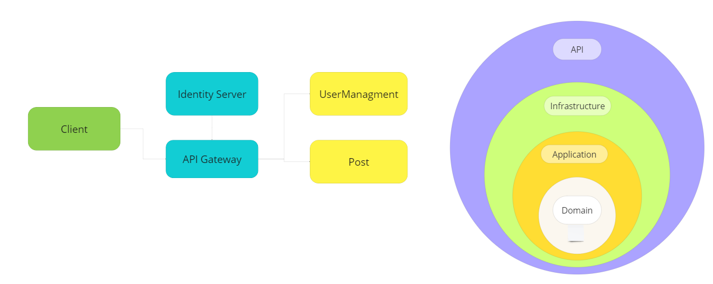
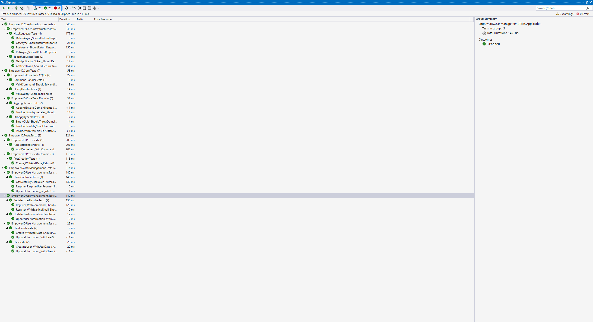
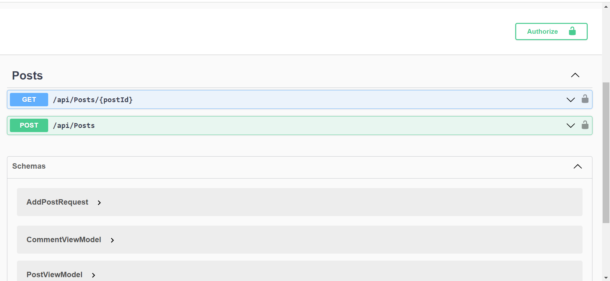
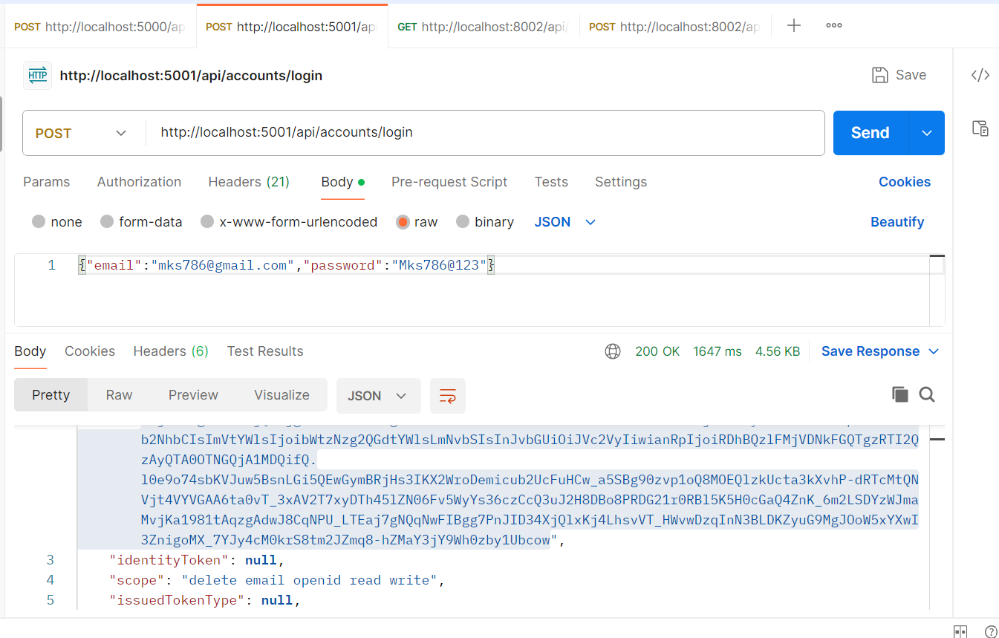
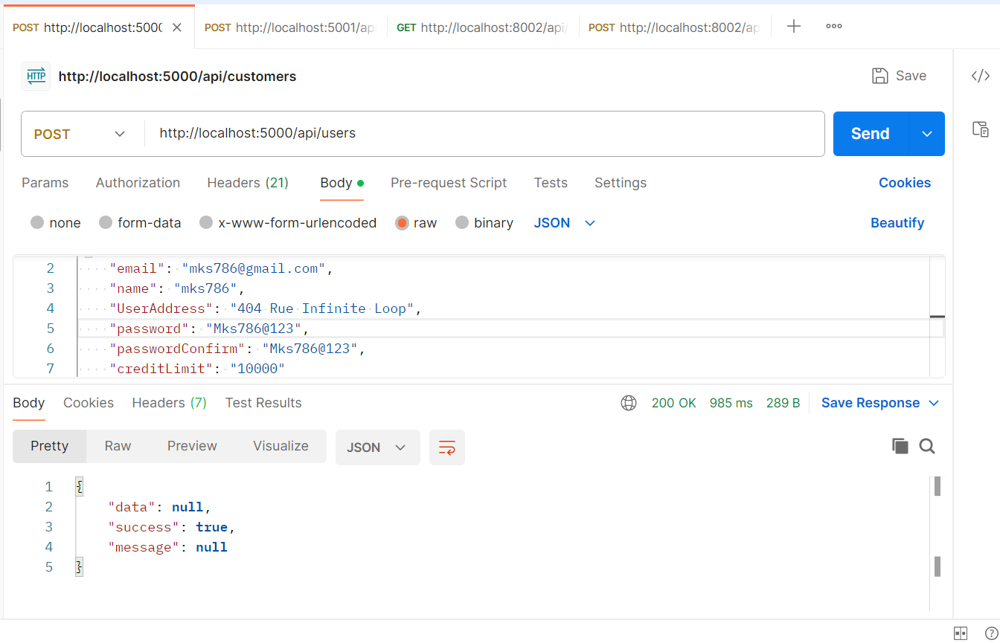
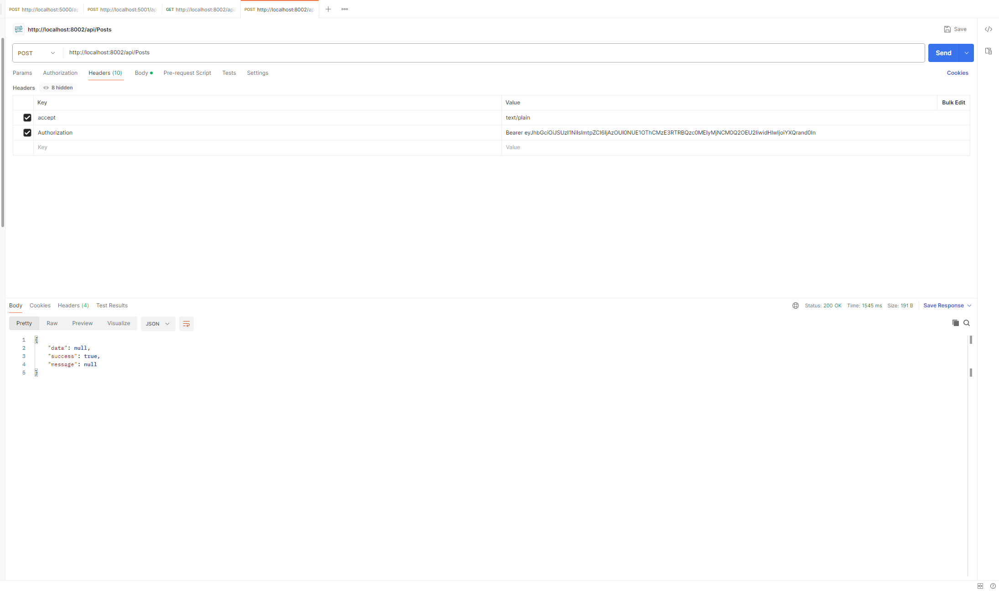
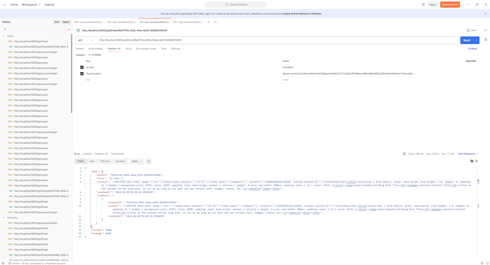

## Welcome To EmpowerID
This project is an experimental application I use to combine several cutting-edge technologies and architectural patterns. Thanks for getting here! please give a ⭐ if you liked the project. It motivates me to keep improving it.

<a href="images/Architecture.png" target="_blank">

</a>
 <br/>

```
src
├── Gateway
│  ├── EmpowerID.Core
│  └── EmpowerID.Core.Infrastructure
│
├── Gateway
│   └── EmpowerID.ApiGateway
│
├── Identity
│   └── EmpowerID.IdentityServer
│
├── Services
│   ├── EmpowerID.Posts
│   └── EmpowerID.UserManagement
│
└── docker-compose
```
- **Core** <br/>
It defines the building blocks and abstractions used on all underlying projects. Its nature is very abstract, with no implementations.
 
- **Core.Infrastructure** <br/>
It holds some abstractions and implementation for infrastructure to be used by all microservices and underlying dependencies.
 
- **Crosscutting** <br/>
It contains project implementations that cross-cut all microservices, such as `IdentityServer` and `API gateway`.
 
- **Services** <br/>
The microservices composing the backend are built to be as simple as possible, structured as a vertically sliced structure with  `API`, `Application`, `Domain,` and `Infrastructure.`
 
    ```
      ├── EmpowerID.Posts
      │   ├── API
      │   ├── Application
      │   ├── Domain
      │   └── Infrastructure
    ```
 
  - **API** <br/>
  RESTful API for enabling communication between client and server.
 
  - **Application** <br/> 
  It orchestrates the interactions between the external world and the domain to perform application tasks through use cases by `handling commands and queries`.
 
  - **Domain** <br/>
  A structured implementation of the domain through aggregates, commands, value objects, domain services, repository definitions, and domain events.
 
  - **Infrastructure** <br/>
  It is a supporting library for upper layers, handling infrastructural matters such as data persistence with *implementing repositories*, database mapping, and external integrations.
 
<br/>
 
## Technologies used
<ul>
<li>
<a href='https://get.asp.net' target="_blank">ASP.NET Core API</a> and <a href='https://learn.microsoft.com/en-us/dotnet/csharp/whats-new/csharp-12' target="_blank">C# 12</a>
    for cross-platform backend with:
<ul>
<li>.NET 8</li>
<li>Ocelot 22.0.1</li>
<li>Marten 6.4.1</li>
<li>MSSQL 2019</li>
<li>Entity Framework Core 8.0.0</li>
<li>Postgres for Entity Framework Core 8.0.0</li>
<li>ASP.NET Core Identity 8.0.0</li>
<li>ASP.NET Core Authentication JwtBearer 8.0.0</li>
<li>Duende IdentityServer 6.3.8</li>
<li>MediatR 12.2.0</li>
<li>Polly 8.2.1</li>
<li>Fluent Assertions 6.12.0</li>
<li>XUnit 2.6.5</li>
<li>NSubstitute 5.1.0</li>
<li>Swagger 6.5.0</li>
<li>Confluent Kafka 2.3.0</li>
</ul>
 
<br/>
 
## What do you need to run it
 
#### Running the microservices using Docker
 
The project was designed to be easily run within docker containers, hence all you need is 1 command line to up everything. Make sure you have `Docker` installed and have fun!
 
 
- Download Docker: <a href="https://docs.docker.com/docker-for-windows/wsl/" target="_blank">Docker Desktop with support for WLS 2</a>
<br/>
 
Using a terminal, run:
 
```console
$ docker-compose up
```
 
You can also set the `docker-compose.dcproj` as a Startup project on Visual Studio if you want to run it while debugging.
 <br/>
<a href="images/Test.png" target="_blank">

</a>
 <a href="images/API.png" target="_blank">

</a>
 <a href="images/Postman-User.png" target="_blank">

</a>
 <a href="images/Postman-User1.png" target="_blank">

</a>
 <a href="images/Postman-Post.png" target="_blank">

</a>
 <a href="images/Postman-Post1.png" target="_blank">

</a>
 <br/>